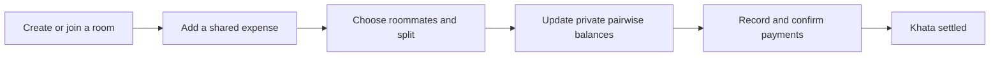

<div align="center">


# KhataKholo

### Shared expenses, clear balances, peaceful rooms.

<a href="https://git.io/typing-svg">
  
</a>

<p>
  A mobile-first expense tracker for hostel rooms and shared homes.
  Add an expense, choose who joined, and let KhataKholo keep the khata straight.
</p>

[](https://khata-kholo.vercel.app/login)
[](https://nextjs.org/)
[](https://supabase.com/)
[](https://web.dev/explore/progressive-web-apps)

</div>

---

## Why KhataKholo?

Shared expenses become awkward when the record is scattered across chats, notes, and memory. KhataKholo gives a room one simple ledger while keeping each roommate's dues private.

- **Flexible expense splitting** — split equally or enter custom shares.
- **Personal khata** — see only balances in which you are involved.
- **Payment confirmation** — record settlements with a two-person confirmation flow.
- **Receipt support** — compress and upload receipt images through Cloudinary.
- **Disputes and reminders** — flag unclear expenses and share payment reminders.
- **Room administration** — add, update, reset, or remove roommate accounts.
- **Private activity history** — follow the transactions relevant to you.
- **Mobile-first PWA** — install it on a home screen and use a dedicated offline page.

## Live App

The production app is available at:

### [khata-kholo.vercel.app/login](https://khata-kholo.vercel.app/login)

Log in with your room code, username or phone number, and six-digit PIN. New groups can start from the **Create room** screen.

## How It Works



## Privacy by Design

KhataKholo does not expose a room-wide debt leaderboard.

- Balances, payments, reminders, and relevant history are filtered to the signed-in roommate.
- Server-side actions verify room membership before changing financial records.
- PINs are stored as hashes, never as plain text.
- Sessions use an HTTP-only custom cookie backed by `roommate_sessions`.
- The Supabase service-role key remains server-only.

> Room admins manage membership and can view general room expenses, but the interface does not reveal private balances between other roommates.

## Tech Stack

| Layer | Technology |
| --- | --- |
| Framework | Next.js 16 App Router, React 19, TypeScript |
| Styling | Tailwind CSS 4 |
| Database | Supabase PostgreSQL |
| Receipt storage | Cloudinary |
| Validation | Zod |
| Testing | Vitest |
| Hosting | Vercel |
| Mobile experience | Web App Manifest + Service Worker |

## Main Routes

| Route | Purpose |
| --- | --- |
| `/create-room` | Create a room and its first admin account |
| `/login` | Sign in with room code, login ID, and PIN |
| `/home` | View the room dashboard and recent activity |
| `/add-expense` | Add an equal or custom-split expense |
| `/khata` | Review private balances and payment actions |
| `/history` | Browse personal financial activity |
| `/profile` | Manage profile, PIN, and session |
| `/admin/roommates` | Manage roommate accounts and roles |

## Local Development

### Prerequisites

- Node.js 20 or newer
- A Supabase project
- A Cloudinary account for receipt uploads

### 1. Clone and install

```bash
git clone https://github.com/zain333ux/KhataKholo.git
cd KhataKholo
npm install
```

### 2. Configure the environment

Copy `.env.example` to `.env.local`, then provide:

```env
NEXT_PUBLIC_SUPABASE_URL=
SUPABASE_SERVICE_ROLE_KEY=
CLOUDINARY_CLOUD_NAME=
CLOUDINARY_API_KEY=
CLOUDINARY_API_SECRET=
```

Never commit `.env.local` or expose `SUPABASE_SERVICE_ROLE_KEY` to browser code.

### 3. Prepare Supabase

For a new database, run these files in order from the Supabase SQL Editor:

```text
supabase/migrations/001_initial_schema.sql
supabase/migrations/002_custom_pin_auth_refactor.sql
supabase/migrations/003_performance_indexes.sql
```

### 4. Start the app

```bash
npm run dev
```

Open [http://localhost:3000](http://localhost:3000).

## Quality Checks

```bash
npm run lint
npm run test
npm run build
```

## Project Structure

```text
src/
├── app/                 # Routes, layouts, server endpoints
├── components/          # Auth, expenses, khata, payments, and UI
├── lib/
│   ├── actions/         # Authenticated server mutations
│   ├── auth/            # PIN hashing and session handling
│   ├── calculations/    # Balance and split calculations
│   ├── queries/         # Privacy-filtered data access
│   └── supabase/        # Server database client
└── types/               # Application and database types

supabase/migrations/     # Database schema and performance indexes
public/                  # PWA icons, manifest assets, service worker
```

## Deployment

1. Import the GitHub repository into Vercel.
2. Add every variable from `.env.example` in **Project Settings → Environment Variables**.
3. Apply the Supabase migrations.
4. Deploy and verify `/login`, room creation, expense entry, and payment confirmation.

---

<div align="center">

Built for roommates who would rather settle the khata than debate it.

[Live App](https://khata-kholo.vercel.app/login) · [Report an Issue](https://github.com/zain333ux/KhataKholo/issues)

</div>
