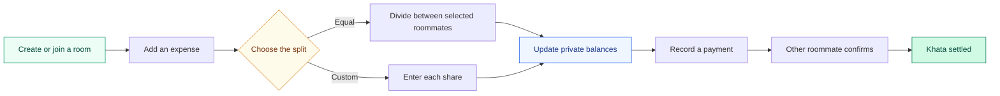

<div align="center">


<br />

<a href="https://khata-kholo.vercel.app/login">
  
</a>

<p>
  A private, mobile-first expense tracker for hostel rooms and shared homes.<br />
  Built for the everyday question: "Wait, who paid last time?"
</p>

<p>
  <a href="https://khata-kholo.vercel.app/login">
    
  </a>
  <a href="https://github.com/zain333ux/KhataKholo">
    
  </a>
</p>

<p>
  
  
  
  
  
  
  
</p>

</div>

## The short version

Room expenses have a habit of disappearing into chat messages, screenshots, and half-remembered promises. KhataKholo keeps one shared record for the room, then shows each person only the balances that involve them.

Add an expense. Choose who shared it. Split the amount equally or set custom shares. KhataKholo handles the pairwise math and keeps the result private.

<div align="center">

| Add it | Split it | Settle it |
| :---: | :---: | :---: |
| Record an expense and attach a receipt | Include the right roommates and choose each share | Confirm payments and close the balance |

</div>

## What you can do

| Feature | What it means in the app |
| --- | --- |
| Flexible splits | Divide an expense equally or enter exact custom shares |
| Personal khata | See your own dues without exposing everyone else's balances |
| Confirmed payments | Both roommates take part in the settlement flow |
| Receipt uploads | Compress and upload receipt images through Cloudinary |
| Disputes | Flag an expense when the amount, members, or note looks wrong |
| Reminders | Share a ready-made payment reminder with the person who owes you |
| Room controls | Admins can add roommates, change roles, reset PINs, and remove accounts |
| Private history | Review the activity connected to your own khata |
| Installable PWA | Add KhataKholo to a phone's home screen and get a dedicated offline view |

## Try the live app

<div align="center">

### [khata-kholo.vercel.app/login](https://khata-kholo.vercel.app/login)

Use your room code, username or phone number, and six-digit PIN to sign in.

[](https://khata-kholo.vercel.app/login)

</div>

New room? Open **Create room**, choose a room code, and create the first admin account. That admin can add the rest of the roommates.

## How the khata moves



## Privacy without the fine print

KhataKholo does not turn the room into a public debt scoreboard.

- The signed-in roommate only receives balances, payments, reminders, and history connected to their account.
- Server actions check room membership before changing financial records.
- The database stores hashed PINs, not readable PINs.
- Login sessions use an HTTP-only cookie backed by `roommate_sessions`.
- `SUPABASE_SERVICE_ROLE_KEY` stays on the server.

Room admins can manage accounts and view the room's general expenses. The interface does not show them private balances between two other roommates.

## Built with

<div align="center">

| Part | Choice | Why it is here |
| --- | --- | --- |
| Web app | Next.js 16, React 19, TypeScript | App Router pages, server actions, and typed code |
| Interface | Tailwind CSS 4, Lucide React | A fast, consistent mobile UI |
| Data | Supabase PostgreSQL | Room, expense, balance, and session records |
| Receipts | Cloudinary | Signed image uploads and delivery |
| Validation | Zod | Safer form and environment input |
| Tests | Vitest | Coverage for splits, balances, PINs, and credentials |
| Delivery | Vercel | Production hosting and environment management |
| Mobile | Manifest and service worker | Home-screen installation and offline fallback |

</div>

## Routes at a glance

| Route | What lives there |
| --- | --- |
| `/create-room` | Room setup and the first admin account |
| `/login` | Room code, login ID, and PIN authentication |
| `/home` | Balance summary and recent room activity |
| `/add-expense` | Equal and custom expense splits |
| `/expenses/[id]` | Expense details and disputes |
| `/khata` | Private balances and roommate khata cards |
| `/khata/[roommateId]` | One pairwise balance and its actions |
| `/payments/confirmations` | Payments waiting for confirmation |
| `/history` | Personal financial history |
| `/profile` | Profile, PIN change, and logout |
| `/admin/roommates` | Roommate accounts, roles, PIN resets, and removal |

## Run it locally

### What you need

- Node.js 20 or newer
- A Supabase project
- A Cloudinary account if you want receipt uploads

### 1. Clone the project

```bash
git clone https://github.com/zain333ux/KhataKholo.git
cd KhataKholo
npm install
```

### 2. Add the environment variables

Copy `.env.example` to `.env.local` and fill in the values:

```env
NEXT_PUBLIC_SUPABASE_URL=
SUPABASE_SERVICE_ROLE_KEY=
CLOUDINARY_CLOUD_NAME=
CLOUDINARY_API_KEY=
CLOUDINARY_API_SECRET=
```

Keep `.env.local` out of Git. The Supabase service-role key must never reach browser code.

### 3. Create the database

Open the Supabase SQL Editor and run the migrations in this order:

```text
supabase/migrations/001_initial_schema.sql
supabase/migrations/002_custom_pin_auth_refactor.sql
supabase/migrations/003_performance_indexes.sql
```

### 4. Start developing

```bash
npm run dev
```

The app will be available at [http://localhost:3000](http://localhost:3000).

## Useful commands

| Command | Purpose |
| --- | --- |
| `npm run dev` | Start the local development server |
| `npm run lint` | Check code style and common mistakes |
| `npm run test` | Run the Vitest test suite once |
| `npm run build` | Create a production build |
| `npm run start` | Serve the production build |

## Project map

```text
KhataKholo/
├── public/
│   ├── icons/              # App and maskable PWA icons
│   └── sw.js               # Service worker
├── scripts/                # Icon generation and development data
├── src/
│   ├── app/                # Pages, layouts, and API routes
│   ├── components/         # Forms, cards, navigation, and shared UI
│   ├── lib/
│   │   ├── actions/        # Authenticated server mutations
│   │   ├── auth/           # PIN hashing and session handling
│   │   ├── calculations/   # Split and balance math
│   │   ├── queries/        # Privacy-filtered database reads
│   │   └── supabase/       # Server database client
│   └── types/              # App and database types
└── supabase/
    └── migrations/         # Schema changes and performance indexes
```

## Deploy to Vercel

1. Import the GitHub repository into Vercel.
2. Add every value from `.env.example` under **Project Settings > Environment Variables**.
3. Apply the Supabase migrations.
4. Deploy.
5. Test login, room creation, expense splitting, and payment confirmation in production.

## Current scope

KhataKholo uses custom room-code and PIN authentication. It does not depend on email login, SMS, paid APIs, recurring expenses, or an approval step for every new expense.

<br />

<div align="center">


### Less spreadsheet. Less guesswork. Better roommate math.

[Live app](https://khata-kholo.vercel.app/login) · [Source](https://github.com/zain333ux/KhataKholo) · [Issues](https://github.com/zain333ux/KhataKholo/issues)

<sub>Made for roommates who would rather settle the khata than debate it.</sub>


</div>
